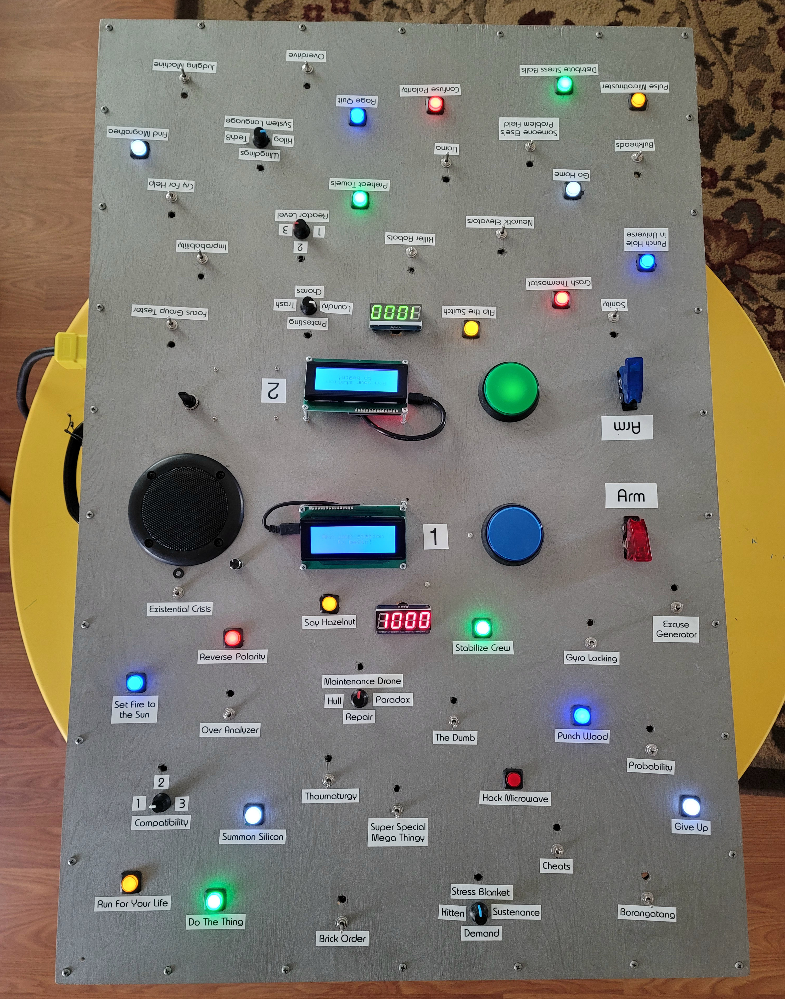
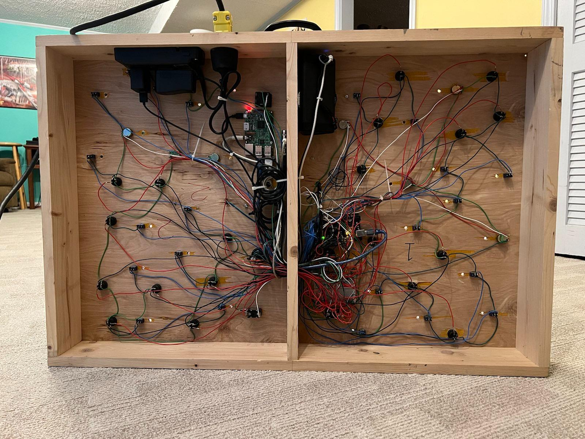

[](https://github.com/chrisl8/PanicStations/actions/workflows/setup.yml)

# Panic Stations
  


This is the code for our Two Player Coop Panel project. It is based on the "Push The Button" game built and coded for the 2018 Winter ICT Game Jam. That code can be seen at the [ictGameJamWinter2018](https://github.com/chrisl8/ictGameJamWinter2018) repository.

# Description

This game is a physical game, in that it is built with an Arduino and lots of buttons and switches.
You won't really be able to play it without building something.

This game is inspired by the mobile game SpaceTeam.

For my panel this code runs on a Raspberry Pi, although it works just as well on a PC. The Pi just allows me to make the project self contained.

## Arduino Setup

This code uses 

## Raspberry Pi Setup

This is intended to run on a Raspberry Pi running **Raspbian** Lite. As of this writing I am using Raspberry Pi OS (32-bit) based on Debian **Bullseye**. Newer or older versions may or may not work without modification.

Put a fresh copy of Raspbian (RASPBERRY PI OS LITE 32-BIT) on your Raspberry Pi then run the installation script below.

You will need to connect a monitor to your Pi and follow the on screen setup instructions to get the OS fully set up and working, including connecting it to your network for installation of this code.

### SSH Remote Access to Pi
Note that Rasbian has the SSH Server disabled by default. Follow their instructions to [enable the SSH server on your Raspberry Pi](https://www.raspberrypi.com/documentation/computers/remote-access.html#enabling-the-server) if you want to do this remotely rather than from the pi itself.

Copied here for convenience:

```
Launch Raspberry Pi Configuration from the Preferences menu

Navigate to the Interfaces tab

Select Enabled next to SSH

Click OK
```

### Pi Serial Port Enable
You **must** enable the serial port on the Pi before running the install below.

Follow the [instructions to enable Serial port on Pi](https://serialport.io/docs/guide-installation#raspberry-pi-linux).

Copied here for convenience:  
```
To enable the serial port on Raspbian, you launch raspi-config, then select Interfacing Options, then Serial. You will then be asked two questions:

Would you like a login shell to be accessible over serial?
Would you like the serial port hardware to be enabled?

You must answer No to question 1 and Yes to question 2. If the login shell is left active, you will experience hangs and or disconnects.
```

A reboot will be required after this.

## Install
There is a script to install everything. Run:

```
bash <(wget -qO- --no-cache -o /dev/null https://raw.githubusercontent.com/chrisl8/PanicStations/main/setup.sh)
```

**A reboot will be required after the first install.**

**NOTICE: If your LCD Displays are brand new, some settings will be saved to them on first run that will not take affect until they are power cycled once. So you may need to power them down by unplugging them from USB or powering off the Pi at least once after the first run before they will display correclty.**

## Setup

There are some settings that you may need to tweak in `node/settings.js`. These should be in some non-committed file, but that is a project for a future update.

## Running the game

If you ran the setup script, it should all be working after your first reboot.  
There are shell scripts to stop, start, restart, and view the log.

## Hardware Setup

### Arduino
The code itself is [Johnny-Five](http://johnny-five.io/) based, and requires one or more Arduino boards with the correct firmata installed to read the button input, write the LED input, and communicate with this code running on your PC or Pi.

#### Installing Firmata on Arduino
1. Download and Install the latest Arduino IDE for your OS from [Arduino Software](https://www.arduino.cc/en/software)
2. Get the Firmata package by:
   3. Open the Arduino IDE
   4. Select the _Tools_ menu.
   5. Select _Manage Libraries..._
   6. Type `Firmata` into the search box.
   7. Find the entry called `Firmata by Firmata Developers` and click _Install_ on it
8. Open the StandardFirmataPlus file by:
   9. Select the _File_ menu.
   10. Select _Examples_
   11. Select _Firmata_
   12. Select _StandardFirmataPlus_
       13. This will open up the StandardFirmataPlus.ino file
14. Install the StandardFirmataPlus by:
    15. Plug your Arduino board into the USB port on your computer
    16. Select it in the dropdown near the top of the IDE
    17. Select _Sketch_ -> _Upload_ or use the Upload button in the IDE

This should upload the Standard Firmata Plus to your Arduino. From now on you won't need to use the Arduino IDE anymore or really think about the Arduino board's software. The [Johnny-Five](http://johnny-five.io/) library within the Node.js application will talk "through" the Arduino to the various components you connect to it. The Arduino has essentially become a peripheral for use by your Node.js code.

### Hardware Notes

#### Arduino Pins
Pins 6 & 7 are the lowest two pins I can seem to use the ARM switches on.
I'm not sure what is up with pins 0 to 5. Need to look that up.

#### Potentiometers
Potentiometers must be powered with FIVE volts from Arduino, not the 3.3v line.

#### Using Analog pins as Digital on Arduino with Johnny-Five
To use Analog pins as Digital, use a number by adding the next pin up (54) to the A number.

#### Pins in use by this project
Switches: pins 32-53
Small Buttons: pins 2-5, 8-13, 22-31

### Version 1.0 Improvements:
* Better box with fancy metalic looking paint.
* Character Displays on board so you don't have to look up at a monitor/TV to get your directions.
* 10 buttons per side instead of 5
* 11 switches per side instead of 5
* More "randomized" pattern for layout
* Lots of playability improvements in the code, but the game play logic is still the same.
    * Positive "SUCCESS" confirmation when you perform your task before your team mate does.
    * Knobs register when they leave the correct zone before your team mate performs their command

### Future Enhancements/TODO
* Lights on the switches and the knobs
    * That is what the extra holes are for.
* ~~Volume control~~
* Improved text and "interactivity" from system as you do things.
* String of lights along the side to indicate progress/score/etc.
* Alternate game modes
    * Self driven Demo mode that just flashes lights
    * User driven demo mode where it just makes sounds and flashes lights when you push buttons and turn knobs.
    * Use lights to "signal" which thing to switch when time runs short.
    * Mode with no commands, just lights to say "push this"
    * Single player mode
    * Competitive mode
        * Not really sure how to do this.
* Add pre-game menu options:
    * Set player count?
    * Set easy/normal/hard difficultly.
* Set "mode" for things like:
    * Not game, just push buttons for noise and lights.
    * "DEMO" Mode where it just makes lights
    * "ENDLESS" mode where the game never ends, you just keep doing the next thing (no timer or failure doesn't count against you)
* Adjust screen brightness and contrast (should reset to default on reboot/power cycle)
* Option to "Swap" LCD displays (and save port) if they are wrong.